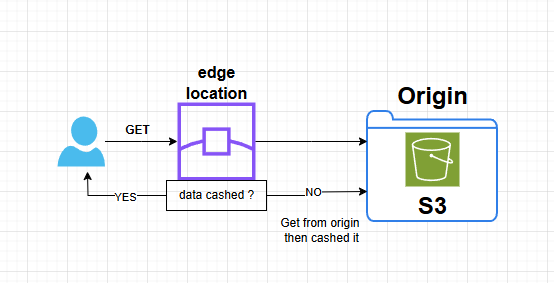
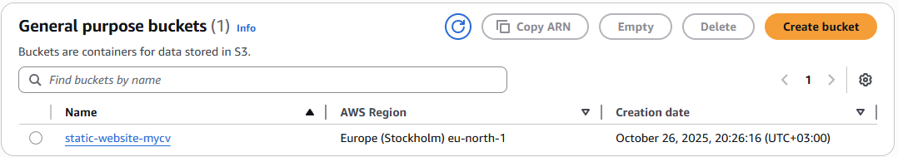
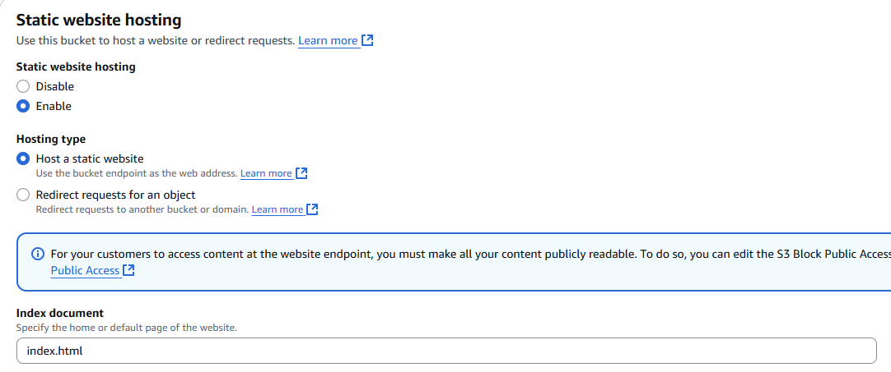
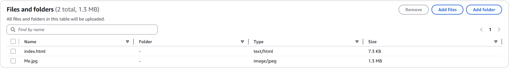
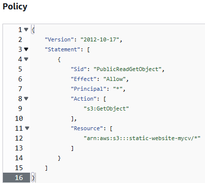
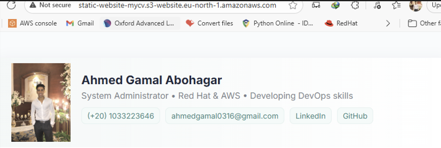
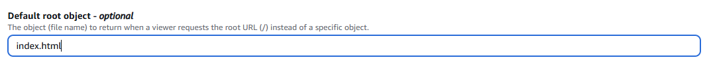
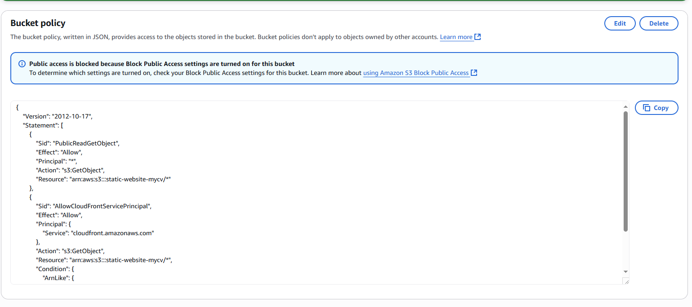
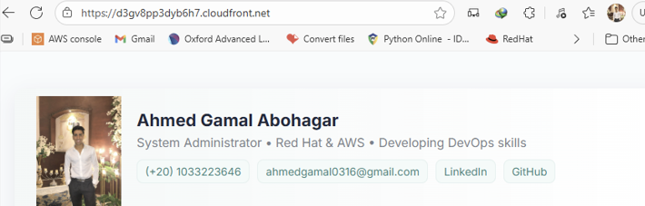
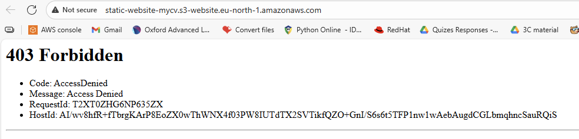

# 🧱 AWS Static Website Hosting Project

## 📌 Overview
This project demonstrates how to **host a static website on AWS** using **Amazon S3** and **CloudFront**.  
The goal was to deploy a simple  website with secure and scalable global content delivery.

---

## 🧰 AWS Services Used
- **Amazon S3** – Static website hosting and file storage  
- **Amazon CloudFront** – Global content delivery network (CDN) with HTTPS  

---

## 🧩 Architecture Diagram

---

## 🚀 Steps Performed

### 1️⃣ Create an S3 Bucket
- Created an S3 bucket named **`static-website-mycv`**
  
- Enabled **Static Website Hosting** :  properties - > static website section -> click edit 
  
- Uploaded website files: `index.html , image ` 
  
- Configured **Bucket Policy** to make the files publicly readable\
  

  This allows everyone to read/view everything in the bucket
  - check accessability : `copy Bucket website endpoint to browser`
    

### 2️⃣ Set Up CloudFront Distribution
- Created a **CloudFront distribution** with the S3 bucket as the origin
  
- add default root object
  
- Configured **Bucket Policy** to make the files only readable by cloudfront service
    - block all public access
    - configure **Bucket Policy**
       
- Configured cache behavior and tested access using the CloudFront URL:  
   
     - if you try to access it by Bucket website endpoint
         
       - because we denied public access

---

## 💡 Key Learnings
- Configuring and hosting a static website on **Amazon S3**
- Using **CloudFront** for secure HTTPS and faster global delivery
- configure policy

---

## 🏁 Result
The static website was successfully hosted using AWS S3 and distributed globally using CloudFront with HTTPS enabled.

---

## 👤 Author
**Ahmed Abohagar**  
💻 Cloud & DevOps Enthusiast | AWS Cloud Practitioner Projects  
📧 [ahmedgamal0316@gmail.com]  
🌐 [[LinkedIn](https://www.linkedin.com/in/ahmed-abohagar/)]
