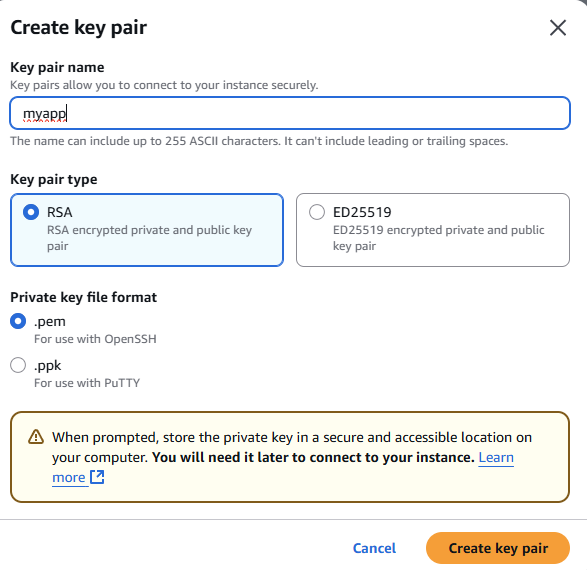
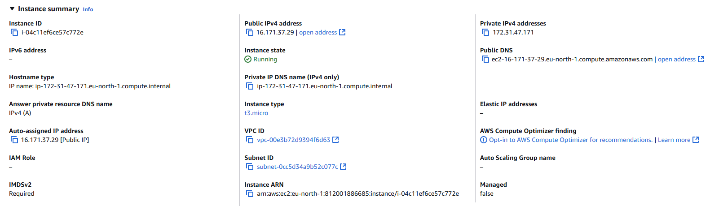
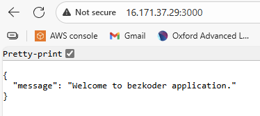

# 🚀 Node.js + MySQL App on AWS EC2

A simple Node.js Express application connected to a MySQL database, hosted on an AWS EC2 instance.

---

## 📦 Project Overview

This project demonstrates how to:
- Deploy a Node.js app on an AWS EC2 instance.
- Connect the app to a MySQL database.
- Run the app as a systemd service.
- Access it through a custom port (e.g., 3000) or via Nginx/CloudFront.

---

## ⚙️ Tech Stack

- **Backend:** Node.js + Express  
- **Database:** MySQL  
- **Hosting:** AWS EC2 (Ubuntu)  
- **Process Management:** systemd service  
- **Environment Variables:** `.env` file

---
## launch EC2 instance
- add name
- choose AMI (ubuntu os)
- choose type (t3 micro)
- create key pair to securely connect to instance
  
[](images/1.PNG)
- allow ssh , http and https
- select key pair and launch instance
  
[](images/2.PNG)


## 🧰 Installation Steps

### 1️⃣ Connect to EC2
```bash
ssh -i "your-key.pem" ubuntu@your-ec2-public-ip
```
### 2️⃣ Update and upgrade system Dependencies and install tools
  ```bash
     sudo apt update -y && sudo apt upgrade -y
     sudo apt install git curl -y
```
### 3️⃣ prepare environment (install nodejs) 
  ```bash
     curl -fsSL https://deb.nodesource.com/setup_18.x | sudo -E bash -
     sudo apt install -y nodejs
```

### 4️⃣ install and configure database (mysql)
- installation and start service
```bash
     sudo apt install mysql-server -y
     sudo systemctl enable mysql
     sudo systemctl start mysql
```

- login

```bash
     sudo mysql -u root -p
```

- setup
  
```bash
     CREATE DATABASE myappdb;
     CREATE USER 'myuser'@'localhost' IDENTIFIED BY 'mypassword';
     GRANT ALL PRIVILEGES ON myappdb.* TO 'myuser'@'localhost';
     FLUSH PRIVILEGES;
     EXIT;
```
### 5️⃣ clone the repo

```bash
     git clone https://github.com/<your-username>/<repo-name>.git
```
- if app on local machine use scp command

### 6️⃣ create .env file
 ```bash
DB_HOST=localhost
DB_USER=myuser
DB_PASS=Pa$$w0rd
DB_NAME=myappdb
PORT=3000
```


### 7️⃣ run app as service
 ```bash
     sudo nano /etc/systemd/system/myapp.service
```
- add this 
 ```bash
[Unit]
Description=My Node.js App
After=network.target

[Service]
ExecStart=/usr/bin/node /home/ubuntu/<repo-name>/server.js
WorkingDirectory=/home/ubuntu/<repo-name>
Restart=always
User=ubuntu
EnvironmentFile=/home/ubuntu/<repo-name>/.env

[Install]
WantedBy=multi-user.target
```
- reload systemd , enable & start myapp.service
 ```bash
     sudo systemctl daemon-reload
     sudo systemctl enable --now myapp
```
### 8️⃣ verfiy 
```bash
     sudo systemctl status myapp
```
- check in your browser
  **can't reach this page**
- allow inbound traffic in port 3000
[](images/4.PNG)
  
- recheck browser ( http://16.171.37.29:3000 )
  
[](images/z.PNG)
  
---
## Security

- Allow inbound traffic on port 3000 (EC2 Security Group).

- For production, use Nginx reverse proxy or CloudFront for HTTPS.

---
## 👨‍💻 Author

**Ahmed Abohagar**  
💻 Cloud & DevOps Enthusiast | AWS Cloud Practitioner Projects  
📧 [ahmedgamal0316@gmail.com]  
🌐 [[LinkedIn](https://www.linkedin.com/in/ahmed-abohagar/)]
