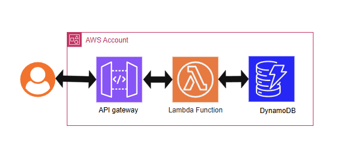
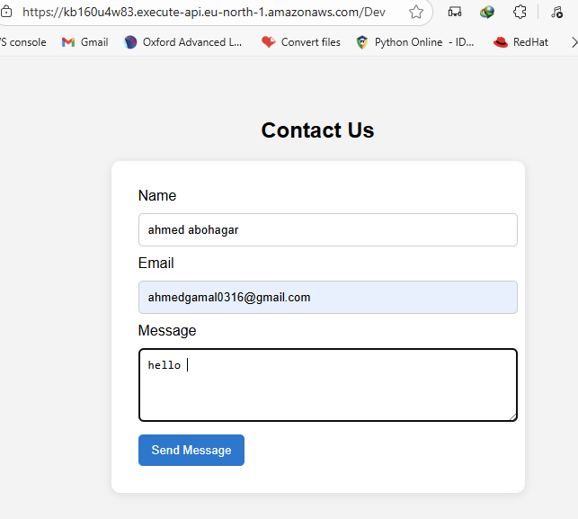
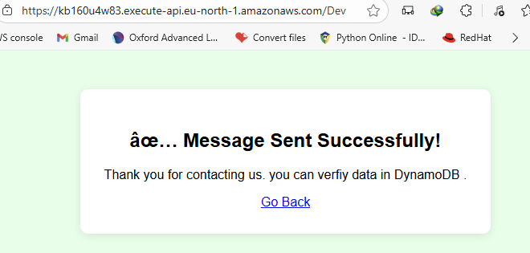
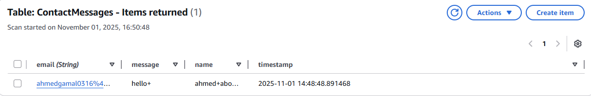
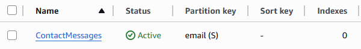
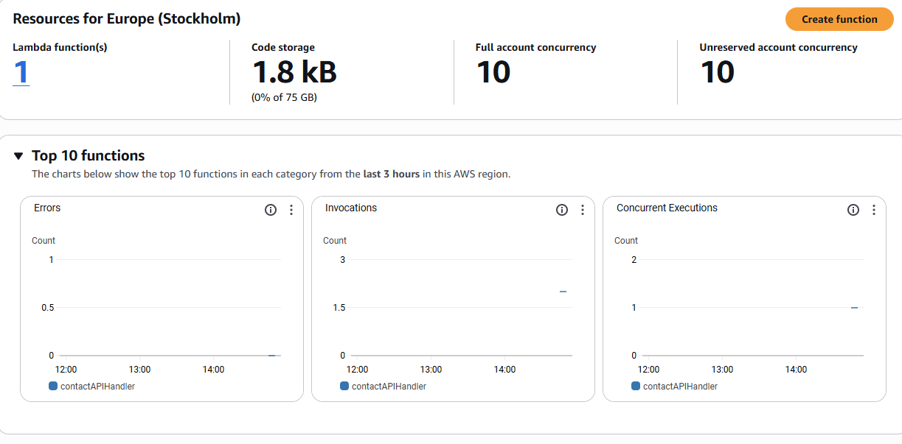
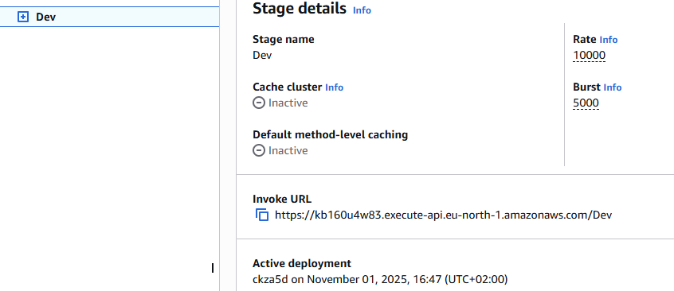

# 🗄️ Project 3: Store and Retrieve Data with AWS DynamoDB + Lambda

## 📘 Overview
This project demonstrates how to build a simple **serverless web backend** using **AWS Lambda**, **API Gateway**, and **DynamoDB**.

Whenever a user submits the **Contact Us** form on the web page:
- The data (name, email, message) is sent to the API Gateway endpoint.
- The API Gateway triggers the Lambda function.
- The Lambda function stores the data in a DynamoDB table and returns a **success page**.

When accessed via a browser (GET request), the Lambda function serves the **Contact Us HTML page**.

---

## 🧠 Concepts Covered
- **Serverless Computing** with AWS Lambda  
- **DynamoDB** NoSQL database  
- **API Gateway** integration with Lambda  
- **IAM Roles** and Permissions  
- **HTML Form Submission (GET/POST)**  

---

## ⚙️ Architecture

[](images/arch.PNG)


---

## 🧩 AWS Services Used
| Service | Purpose |
|----------|----------|
| **AWS Lambda** | Runs backend logic (Python) |
| **Amazon DynamoDB** | Stores contact form submissions |
| **Amazon API Gateway** | Acts as the public API endpoint |
| **IAM** | Grants Lambda access to DynamoDB |

---

## 🧰 Installation Steps

### 1️⃣ create IAM role to allow lambda read / write from dynamoDB 
- Name: lambda-dynamodb-role
[](images/IAM.PNG)
### 2️⃣ create lambda Function
- Name: contactAPIHandler
- Runtime: Python 3.13
- Handler: lambda_function.lambda_handler
- attach IAM Role
- Upload .zip file containing
```bash
    contact-us.html
    labda_function.py
    success.html
```
### 3️⃣ create dynamoDB table 
- Name: ContactMessages
- Primary Key: email (String)

### 4️⃣ creat API
- Create HTTP API
- Integration Target: Lambda function ( contactAPIHandler )
- Methods:
    - GET → serves contact-us.html
    - POST → stores data and serves success.html

### 5️⃣ test
- Open API endpoint URL in a browser to load the form
[](images/cont.PNG)
- Submit the form and verify that:
    - You get the success page.
      
    [](images/succ.PNG)
    - The data appears in the DynamoDB table.
    [](images/item.PNG)

---

## 📸 Screenshots

Below are the screenshots showing each step of the project setup and execution:

| Step | Description | Screenshot |
|------|--------------|-------------|
| 🧩 1 | **DynamoDB Table** creation (`ContactMessages`)  |  |
| ⚙️ 2 | **Lambda Function** configuration (Python code uploaded, handler, permissions) |  |
| 🌐 3 | **API Gateway** integration with Lambda (GET + POST methods) |  |
| 🧾 4 | **Contact Us Page** (GET request) displayed from Lambda |  |
| ✅ 5 | **Success Page** after submitting the form (POST request) |  |
| 💾 6 | **Data Stored** successfully in DynamoDB table |  |


---

## 🔗 Project Files & Source Code

| File | Description | Link |
|------|--------------|------|
| `lambda_function.py` | Main backend function that handles GET/POST and connects to DynamoDB | [View File](./code/lambda_function.py) |
| `contact-us.html` | Front-end form served when user accesses the endpoint | [View File](./code/contact-us.html) |
| `success.html` | Success page displayed after form submission | [View File](./code/success.html) |
| `README.md` | Full project documentation | [View File](./README.md) |


---

## ✅ Final Deliverables

- [x] Lambda function working successfully  
- [x] Data inserted in DynamoDB table  
- [x] GET/POST tested through API Gateway  
- [x] HTML pages properly served  
- [x] Screenshots added to `screenshots/` folder  
- [x] Code uploaded to GitHub  


---
## 👨‍💻 Author

**Ahmed Abohagar**  
💻 Cloud & DevOps Enthusiast | AWS Cloud Practitioner Projects  
📧 [ahmedgamal0316@gmail.com]  
🌐 [[LinkedIn](https://www.linkedin.com/in/ahmed-abohagar/)]
