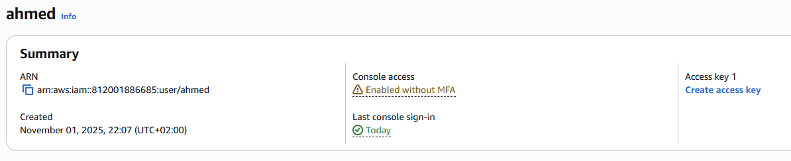
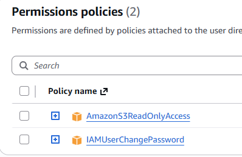
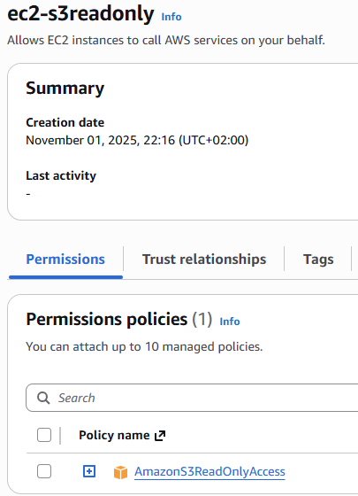
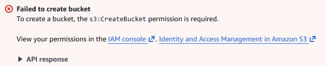

# 🔐 Project 4: Use IAM Policies and Roles to Secure Access

## 📘 Overview
This project demonstrates how to use **AWS Identity and Access Management (IAM)** to implement secure access control in the AWS environment.  
You will create IAM users, roles, and policies to apply the **principle of least privilege** — giving users only the permissions they need.

---

## 🧠 Concepts Covered
| Concept | Description |
|----------|--------------|
| **IAM User** | Represents a person or application that interacts with AWS. |
| **IAM Role** | A temporary identity with specific permissions, often used by AWS services (e.g., EC2). |
| **IAM Policy** | A JSON document that defines permissions (who can do what). |
| **Least Privilege Principle** | Give only the minimum required permissions for a specific task. |

---

## 🧩 AWS Services Used
| Service | Purpose |
|----------|----------|
| **IAM** | Create and manage users, roles, and policies |
| **S3** | Used to test read-only permissions |
| **EC2** | Used to test role-based permissions |

---

## 🧱 Steps to Implement

### 1️⃣ Create a New IAM User
1. Go to **IAM Console → Users → Add User**  
2. User name: `readonly-user`  
3. Access type: ✅ **AWS Management Console access**  
4. Set a password and enable console access.

---

### 2️⃣ Attach a Read-Only Policy
1. Under **Permissions**, choose **Attach policies directly**  
2. Search and select `AmazonS3ReadOnlyAccess`  
3. This grants the user permission to **view** S3 buckets and objects but **not modify** them.

---

### 3️⃣ Create an IAM Role
1. Go to **IAM → Roles → Create Role**  
2. Select **AWS Service → EC2**  
3. Attach the same policy `AmazonS3ReadOnlyAccess`  
4. Name the role: `EC2S3ReadOnlyRole`

---

### 4️⃣ Test Access
| Test | Expected Result |
|------|------------------|
| Login with `readonly-user` and open **S3** | ✅ Can view buckets |
| Try creating or deleting an object | ❌ Access Denied |
| Try opening **EC2** or **DynamoDB** | ❌ Access Denied |
| Attach `EC2S3ReadOnlyRole` to an EC2 instance and test reading S3 | ✅ Works fine |

---

## 🧾 Deliverables
| Step | Description | Screenshot |
|------|--------------|-------------|
| 1️⃣ | IAM user created (`readonly-user`) |  |
| 2️⃣ | Policy attached: `AmazonS3ReadOnlyAccess` |  |
| 3️⃣ | IAM role created (`EC2S3ReadOnlyRole`) |  |
| 4️⃣ | Access to S3 buckets (Read-only) |  |

---

## 🔗 Project Files

| File | Description | Link |
|------|--------------|------|
| `README.md` | Full project documentation | [View File](./README.md) |

---

## ✅ Final Deliverables

- [x] IAM user created with least privilege  
- [x] IAM role configured for EC2 access  
- [x] Policy tested for access control  
- [x] Screenshots uploaded to `screenshots/` folder  
- [x] Documentation uploaded to GitHub  

---

## 👨‍💻 Author

**Ahmed Abohagar**  

💻 Cloud & DevOps Enthusiast | AWS Cloud Practitioner Projects  

📧 [ahmedgamal0316@gmail.com]  

🌐 [[LinkedIn](https://www.linkedin.com/in/ahmed-abohagar/)]
---
